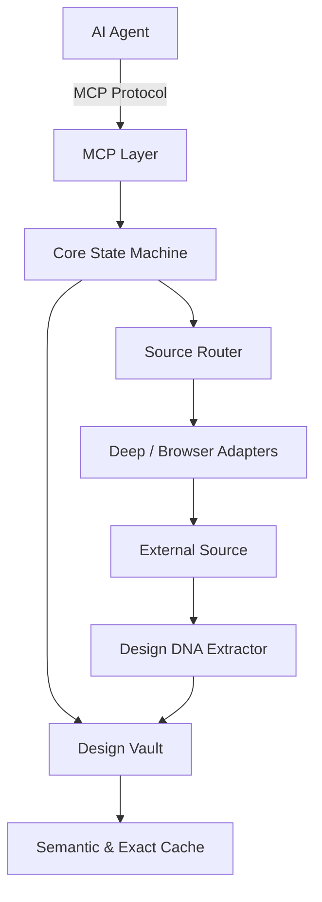

# DesignOS Architecture

DesignOS-MCP is built as a robust modular monorepo. It manages the complete design intelligence pipeline from the MCP boundary down to the source registry and caching layers.

## High-Level Pipeline

## Security Boundaries

1. **MCP Boundary**: All AI agent interactions flow through validated Zod schemas. The MCP server restricts filesystem access strictly to the current project's scope.
2. **Browser Layer**: All pages inspected through TinyFish or Playwright are treated as untrusted. Output is strictly sanitized before hitting the LLM context.
3. **Open Design Compatibility**: Imported skills and components are validated against provenance and license headers before being loaded into the design vault.

## Module Responsibilities

- **`core`**: Manages the overarching ProjectSession state machine, handling state transitions (e.g. `NEW` → `DISCOVERY` → `MOODBOARD`).
- **`mcp`**: Implements the official `@modelcontextprotocol/sdk` to expose capabilities like `designos.research` and `designos.qa`.
- **`database`**: SQLite-backed repository patterns mapping directly to types defined in `contracts`.
- **`optimization`**: Houses `SemanticCache`, `ExactCache`, `Caveman` compression, and the `TokenGovernor` to ensure context limits are rigorously respected.
- **`source-registry`**: Maintains the registry of 270+ component and inspiration sources.
- **`design-dna`**: Analyzes visual reference data and extracts layout, typographic, color, and motion principles.
- **`production`**: Automates asset generation (videos, mockups, store campaigns) upon project completion.
