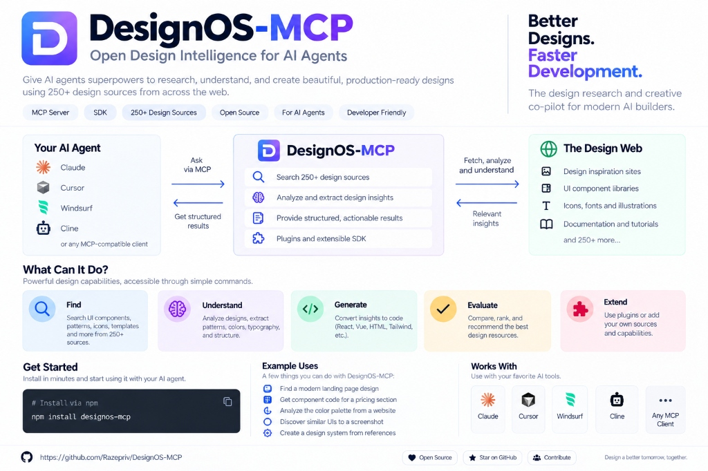
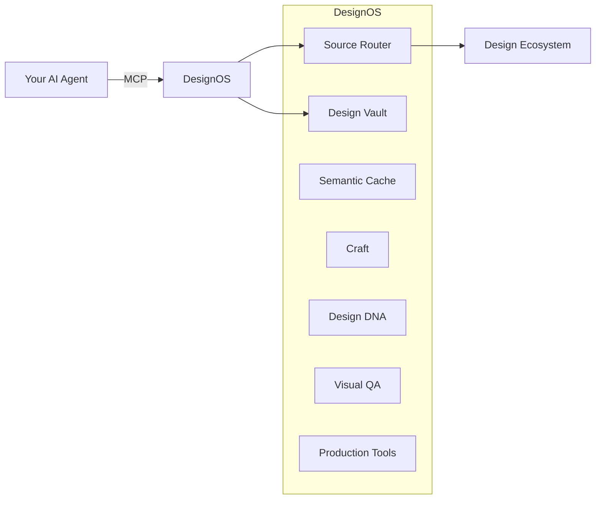

<p align="center">
  
</p>

<h1 align="center">DesignOS-MCP</h1>

<p align="center">
  <strong>Design intelligence infrastructure for AI coding agents.</strong>
</p>

<p align="center">
  <a href="https://github.com/Razepriv/DesignOS-MCP/blob/main/LICENSE"></a>
  <a href="https://nodejs.org/"></a>
  <a href="https://www.typescriptlang.org/"></a>
  <a href="https://modelcontextprotocol.io/"></a>
  <a href="./docs/sources.md"></a>
</p>

<p align="center">
  DesignOS-MCP gives AI coding agents structured access to hundreds of design references, UI libraries, motion systems, design patterns, visual intelligence, and production workflows through MCP and SDK interfaces.
</p>

<p align="center">
  
</p>

## What is DesignOS?

DesignOS is an MCP server and SDK that gives AI agents structured design research, visual intelligence, design-system knowledge, reusable references, and production-oriented design workflows.

Instead of an AI coding agent searching the web blindly or inventing generic UI, **DesignOS gives it a searchable design intelligence layer**.

---

## Why DesignOS?

AI coding agents are strong at implementation but often lack:
- persistent design knowledge;
- structured visual research;
- design reference discovery;
- component intelligence;
- motion intelligence;
- design memory;
- consistent visual QA;
- reusable production workflows.

DesignOS provides that missing layer.

---

## What It Can Do

| Capability | What it does |
|---|---|
| **Design Research** | Searches curated design sources and returns relevant references. |
| **Design DNA** | Converts references into structured layout, typography, color, motion, and interaction insights. |
| **Visual Search** | Finds visually related patterns from screenshots. |
| **Component Intelligence** | Searches component libraries and identifies implementation options. |
| **Design Vault** | Stores reusable project and design knowledge. |
| **Semantic Cache** | Reuses previous research instead of repeating expensive work. |
| **Craft Rules** | Applies reusable typography, accessibility, motion, and UX principles. |
| **Visual QA** | Compares implementation against approved design direction. |
| **Production Workflows** | Generates structured inputs for screenshots, launch creative, mockups, and video. |
| **Open Design Compatibility** | Imports selected compatible skills, templates, design systems, and craft references. |

---

## How It Works



---

## Works With

- **Codex**
- **Claude Code**
- **Cursor**
- **Gemini CLI**
- **OpenHands**
- **any compatible MCP client**

---

## Design intelligence from hundreds of sources

We have registered and verified **270+** design sources covering:

**Component Libraries** • **Design Inspiration** • **Product UI** • **Mobile UX** • **Motion** • **3D / WebGL** • **Design Systems** • **Typography** • **Branding** • **Ecommerce** • **Email** • **Data Visualization** • **No-code / Webflow / Framer**

**Representative Examples:**
shadcn/ui • Aceternity • Magic UI • Mobbin • SaaSFrame • Awwwards • Godly • GSAP • Motion • Three.js • Spline • Relume

[See the complete source registry →](./docs/sources.md)

---

## Quick Start

```bash
git clone https://github.com/Razepriv/DesignOS-MCP.git
cd DesignOS-MCP
pnpm install
pnpm designos:setup
pnpm designos:doctor
```

Then start the server:
```bash
pnpm dev
```

### MCP Configuration Example

To use DesignOS in Cursor or Claude, configure your MCP settings:

```json
{
  "mcpServers": {
    "designos": {
      "command": "node",
      "args": ["/absolute/path/to/DesignOS-MCP/packages/mcp/dist/index.js"]
    }
  }
}
```

[See full MCP setup instructions →](./docs/mcp-setup.md)

---

## Example AI Agent Requests

- *"Find modern SaaS dashboard references with restrained motion."*
- *"Analyze this screenshot and identify its layout, typography and spacing system."*
- *"Find React components suitable for recreating this interaction."*
- *"Research premium onboarding patterns for a fintech mobile app."*
- *"Extract Design DNA from these three reference URLs."*
- *"Compare these hero directions and explain the structural differences."*
- *"Find motion references that can be implemented using GSAP."*
- *"Create a design research pack for this PRD."*

---

## MCP Tools

| Tool | Purpose |
|---|---|
| `designos.project.create` | Create a project |
| `designos.research` | Run targeted design research |
| `designos.visual_search` | Search using visual similarity |
| `designos.reference.inspect` | Inspect a design reference |
| `designos.design_dna.extract` | Generate structured Design DNA |
| `designos.components.find` | Search component sources |
| `designos.capture` | Capture page/reference data |
| `designos.qa` | Run visual QA |
| `designos.metrics` | View cache/token metrics |

---

## Architecture & Caching

Built to avoid repeated work, DesignOS utilizes **Token & Cache Efficiency**:
- Exact Cache & Semantic Cache
- Design Vault (Persistent knowledge layer)
- Caveman Compression & Progressive Retrieval
- Token Governor

[Read the full Architecture Guide →](./docs/architecture.md)

### Design intelligence, not UI copying

DesignOS does not blindly scrape or copy websites. The pipeline relies on fundamental understanding:
**Reference → Inspect → Understand → Extract Design DNA → Apply project requirements → Create original direction**

---

## Open Design Integration

DesignOS can selectively interoperate with [Open Design](https://github.com/nexu-io/open-design) through a compatibility layer.
DesignOS does not blindly embed or fork Open Design. Compatible permissively licensed skills, craft references, templates, design systems, frames, and plugin metadata can be imported through the upstream compatibility layer.

[Read about Open Design Integration →](./docs/open-design.md)

---

## Roadmap & Status

| Area | Status |
|---|---|
| MCP Core | ✅ Stable |
| Project State | ✅ Stable |
| Source Registry | ✅ Stable (270 sources) |
| Design Vault | 🚧 In progress |
| Visual Search | 🚧 Planned |
| Moodboard | 🚧 Planned |
| Visual QA | 🚧 Planned |
| Production Studio | 🚧 Planned |

---

## Contributing

DesignOS is designed to grow through new sources, adapters, craft rules, integrations, and production capabilities. 
Possible contribution areas:
- new source adapters;
- design source registry entries;
- craft rules;
- MCP tools;
- browser integrations;
- tests;
- docs;
- production pipelines.

[Read the Contribution Guide →](./CONTRIBUTING.md)

---

## License & Security

DesignOS-MCP is licensed under the Apache License 2.0.
Third-party sources, plugins, design systems, and imported assets may have their own licenses. DesignOS preserves provenance and does not treat third-party content as automatically redistributable.

- [LICENSE](./LICENSE)
- [Security Policy](./SECURITY.md)

---

<p align="center">
  <em>Built as open infrastructure for AI-assisted design and software development.</em><br/>
  <strong>DesignOS-MCP • Open Source</strong>
</p>
